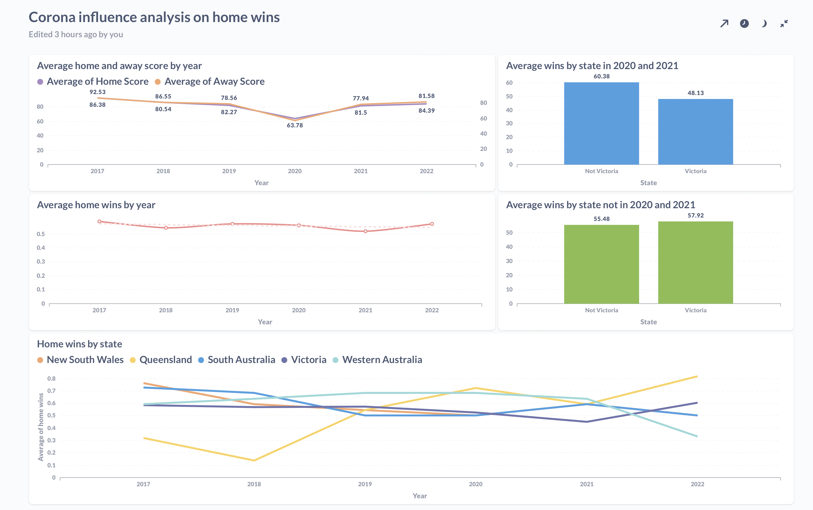
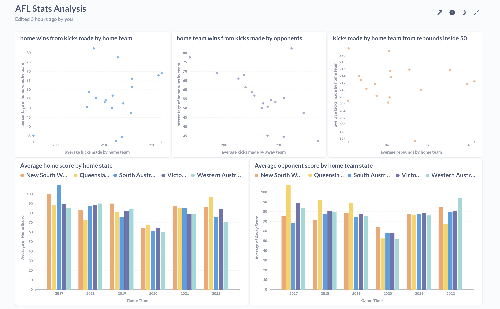

# Data Warehouse Analyst diploma project

The goal of the project is to create a system for collection,storage ana analysis of Australian Football League (AFL). 

Although the AFL data can be collected via different paid sources, there is only one robust free data source - `fitzRoy` library for R programming language. Therefore, people, whose level of R programming is insufficient for usage the given library, are not able to collect statistical data easily. The project adopts `fitzRoy` library for analysis which could be made in either `Python` or `SQL`. 

## Table of contents

1. [Infrastructure](README.md#infrastructure)
2. [Data extraxtion](README.md#data-extraxtion)
3. [Data transformation](#data-transformation)
4. [Data analysis and visualization](#data-analysis-and-visualization)
5. [Machine learning predictive model](#machine-learning-predictive-model)
6. [References](#references)

# Infrastructure

There are two infrastructure solutions have been choosen for the project.

- [deployment on local machine in docker](/infrastructure/local/)

- deployment in [cloud (Yandex.Cloud)](/infrastructure/yandex-cloud-solution/) using terraform

To run the project in a local environment, the following command has to be executed:

```docker-compose up --build -d```

After this, **Apache Airflow** and **Postgres** database will be laucnhed, and can be used. 

# Data extraxtion

To start a data extraction process, an airflow connection `afl_db`,used by SQL operators, has to be determined.

By default, in a local development environment this connection should be:

- **Connection Id**: afl_db
- **Connection Type**: Postgres
- **Host**: 172.17.0.1
- **Schema**: afl-db
- **Login**: analyst
- **Password**: analyst
- **Port**: 5432

### The basic logic of the data extraxtion process is next:

- There are two data collection files - *[collect_new.R](infrastructure/local/scripts/collect_new.R)* and *[get_data.R](infrastructure/local/scripts/get_data.R)*

- Both files install and load required libraries. The installation process may take some time. Although including installation into collect_new.R is not neccessary, I decided to do it just in case. 

- Both scripts perform very simple jobs. They collect data, do some filtering and save it into a disck. By default, the last year data of initial data collection is **2022**. It can be changed manually if needed. 

- The next filepaths are used in Airflow by default:

```
total_results_path = /opt/airflow/total_results.csv
round_results_path /opt/airflow/round_results.csv
total_tips_path = /opt/airflow/total_tips.csv
round_tips_path = /opt/airflow/round_tips.csv
player_stats_path = /opt/airflow/player_stats.csv
round_stats_path = /opt/airflow/round_stats.csv
```

- At first step the Dag checks if afl schema exists in the database, if not, it creates one and starts loading data into tables. **BranchSQLOperator** is used at this step. 

- By default, schema name is **afl**. So, if you decided to change it, please, change schema name everywhere in the code.

- If schema does not exist a script *get_data.R* is running and all data is collected on a disk as 3 csv files. This may take some time, you should wait.

- Then, data is inserted into an analytical db as 3 staging tables *stg_total_tips*, *stg_total_results*, *stg_player_stats*

- If the **afl** schema already exists in a database, the DAG collects current year and last round recorded into the database

- Next, the DAG runs *collect_new.R* script and new stats are saved into 3 csv files on a disk

- After this, DAG inserts data into the db

Going by the small volume of the data, I decided to use pandas as recording tool. A method *to_sql* provides an opportunity to insert records into a table relatively easy and fast.

# Data transformation

For the data transformation **dbt** is used.

To run dbt, firstly create a python virtual environment and install it if you have not done it yet.

For example, run the following commands:

```python -m venv <your environment name>```

```source <your environment name>/bin/activate```

```pip3 install dbt-postgres```

```dbt init <your project name>```

Then, change **.dbt/profiles.yml** file accodingly.

There are five marts which will be created in a database:

- **tips_total_mart** containing all historical tips
- **coming_round_mart** containing tips only for coming round
- **regular_season_match_stats** containing stats for every game played from 2017
- **ml_mart_train** containing data for machine learning model training
- **data_for_prediction** containing data for machine learning model prediction

There are three main model folders into dbt project:

- **staging** where initial data is collected. For instance, I have choosen four tips sources - 'Squiggle', 'Matter of Stats', 'Aggregate', and 'Graft'. However, the given subset can be changed. 

- **aux** where all auxiliary transformations have been done. 

- **marts** where data is transformed into final marts.

To apply all transformations just perform ```dbt run`` in the dbt project directory.

# Data analysis and visualization

For analysis and visualization I used metabase. It can be simply run using [this](dataviz/docker-compose.yaml) docker-compose file. You can also install Metabase locally or use another Data Vizualization tool.

Here are some examples of vizualizations could be made.



# Machine learning predictive model

I have also [created](prediction/baseline_afl_ml.ipynb) a machine learning baseline models to demonstrate how this project can be used in prediction of AFL games.

# References 

- **[FitzRoy R library]**(https://cran.r-project.org/web/packages/fitzRoy/index.html)